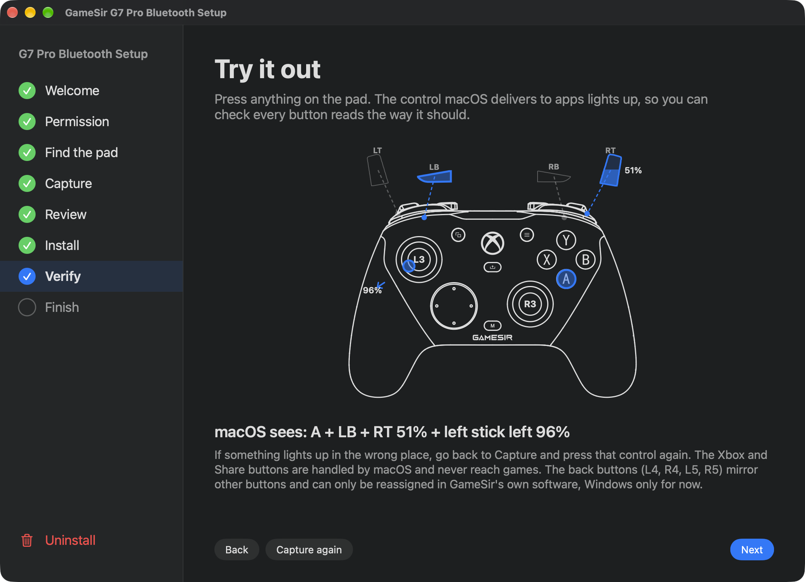

# GameSir G7 Pro over Bluetooth on macOS

This app makes the GameSir G7 Pro work as a real game controller on macOS over **Bluetooth**.
After setup, the pad appears in System Settings › Game Controllers. Games that use Apple's
GameController framework see it, including GeForce NOW, Apple Arcade, and Safari's Gamepad API.

Out of the box, macOS pairs the pad and calls it a "Gamepad", yet no game sees it. The pad is
missing from Apple's controller database. This app adds it. No kernel extensions, no background
processes, no remapping software: one database entry and one mapping file, installed by a wizard.

We tested it on macOS 27.0 with G7 Pro firmware 1.1.11. Apple introduced the database in macOS 14,
so macOS 14 and later must work.



## Quick start

1. Turn off System Integrity Protection (SIP) for the install. You turn it back on at the end.
   - On Apple Silicon: shut down. Hold the power button until "Loading startup options" appears.
     Choose Options › Continue. Open Utilities › Terminal. Run `csrutil disable`. Restart.
   - On Intel: restart while holding Cmd-R. Open Utilities › Terminal. Run `csrutil disable`. Restart.
2. Download the app from the [Releases](../../releases) page. Unzip it.
3. Open the app once. macOS blocks it, because we have not notarized it yet.
4. Open System Settings › Privacy & Security. Scroll to the bottom. Click **Open Anyway**.
   Terminal alternative: run `xattr -dr com.apple.quarantine "GameSir G7 Pro Bluetooth Setup.app"`.
5. Follow the wizard. It asks for Input Monitoring, finds the pad, captures every control, computes
   the mapping, installs it with your admin password, and lets you try it out.
6. Turn SIP back on the same way, with `csrutil enable`.

## What the wizard does

| Step | What happens |
|---|---|
| Welcome | Checks SIP. If SIP is on, shows the Recovery steps. |
| Permission | Asks macOS for Input Monitoring once. The app needs it to read the pad's raw buttons. |
| Find the pad | Waits for the G7 Pro over Bluetooth. Reads its firmware version, which the database entry must match. |
| Capture | Asks for each control in turn and records what the pad sends. A press that differs from the reference mapping gets a second check. |
| Review | Computes the index macOS uses for every control. Writes the mapping file. |
| Install | Patches the database, installs the mapping, and restarts the controller daemon. Backs up the original plist first. An option, on by default, makes the pad identify as an Xbox One controller so games draw Xbox glyphs. It can fail in some games and in Steam Input. |
| Verify | Press anything. The control macOS delivers lights up. Sticks and triggers show their travel. |
| Finish | Reminds you to turn SIP back on. |

The red **Uninstall** item at the bottom of the rail removes the entry and mapping again.
The wizard keeps your capture in `~/Library/Application Support/G7Pro Bluetooth Setup/`.

## Command line

The app bundles a command-line tool with the same core:

```sh
APP="/Applications/GameSir G7 Pro Bluetooth Setup.app"
"$APP/Contents/MacOS/g7pro" status                 # SIP, pad, firmware, entry, what macOS reports
sudo "$APP/Contents/MacOS/g7pro" install           # bundled mapping, connected pad's firmware version
sudo "$APP/Contents/MacOS/g7pro" install --personality my.plist --version 283
sudo "$APP/Contents/MacOS/g7pro" uninstall
```

## How it works

The G7 Pro's Bluetooth mode is its Android mode. It presents a composite HID device: a Consumer
Control collection first, then gamepad, keyboard, and mouse collections. Apple's daemon,
`gamecontrollerd`, adopts a third-party HID pad only if the database lists its vendor ID, product ID,
and firmware version. The database ships as a MobileAsset:

```
/System/Library/AssetsV2/…/com_apple_MobileAsset_GameController_DB1/…/GameControllers-Custom.bundle
```

Its `Info.plist` lists supported pads. Each entry points at a "personality" plist that maps HID
elements to the standard gamepad layout, with predicates like `UsageType == 1 AND UsageTypeIndex == 6`.
Apple lists the GameSir X3 there. Apple does not list the G7 Pro, so the daemon logs
`is NOT a supported game controller` and ignores it.

We had to discover two things:

1. **The pad's wiring.** Which HID usage each physical button sends. The wizard captures this rather
   than assuming it, so a firmware change that reorders buttons only needs a new run.
2. **How Apple numbers `UsageTypeIndex`.** It is not "the Nth button in the gamepad collection".
   The daemon takes every input element on the whole device, sorts same-type usages by usage value,
   and numbers those. The mouse collection has buttons 1 to 5 and X/Y axes, and they interleave with
   the gamepad's. Gamepad button 1 is index 0, mouse button 1 is index 1, gamepad button 2 is index 2,
   and so on. The app computes each index from the pad's real element list.

The personality's `ProductCategory` sets the controller type games see. The daemon honours
"Xbox One" for a third-party entry, so the wizard sets it by default and games show Xbox glyphs.
Rumble is impossible in Bluetooth mode: the pad's descriptor has no force-feedback output. A game that
expects an Xbox pad to rumble gets nothing. Wired mode has rumble.

The pad sends the Xbox button as a Consumer Control "AC Home" key. macOS keeps it as the system
button. The pad sends Share as a keyboard PrintScreen keystroke, which no game sees as a gamepad button.
The back buttons L4, R4, L5, and R5 mirror other buttons. Only GameSir's own software can reassign
them, and that software runs on Windows only for now.

## Repository layout

```
data/device.json           pad identity, database identifier, personality paths
data/controls.json         the controls the wizard walks through: prompts, identifiers, drawing positions
data/callout-glyphs.json   silhouettes of the triggers and bumpers, traced from the manual's top view
data/controller-front.svg  the pad's front view, extracted from the vector art in GameSir's manual
data/reference-mapping.json a verified capture; the wizard double-checks presses against it
schemas/*.schema.json      JSON Schema for each data file, with a description of every field
personality/…plist         the personality template (derived from Apple's GameSir X3 entry)
src/Core.swift             headless logic: raw HID, framework observer, the index rule, capture → personality
src/Install.swift          database patching and daemon restart (runs as root)
src/main.swift             the `g7pro` command-line tool
src/App.swift              the SwiftUI wizard
tools/pdfpaths.swift       PDF vector extractor that produced the controller drawing
tools/icon.swift           renders the app icon from the drawing
Tests/G7ProCoreTests       Swift Testing unit tests, plus a recording of the pad's HID elements
Package.swift              exposes the core as a library for `swift test`; build-app.sh builds the app
build-app.sh               builds the .app (needs Xcode Command Line Tools); ad-hoc signed
.github/workflows          builds and publishes the zip on tags
```

The UI stays thin. Every decision lives in `src/Core.swift` or the JSON files, so another front end
can reuse them unchanged.

## Building from source

1. Install the Xcode Command Line Tools: run `xcode-select --install`. You do not need full Xcode.
2. Clone the repo and build:

   ```sh
   git clone https://github.com/arcataroger/gamesir-g7-pro-bluetooth-for-macos.git
   cd gamesir-g7-pro-bluetooth-for-macos
   ./build-app.sh          # → build/GameSir G7 Pro Bluetooth Setup.app  and  build/g7pro
   open build/*.app
   ```

A locally built app carries no quarantine flag, so Gatekeeper accepts it.

Run `swift test` for the unit tests. They cover the index rule, the personality writer, press and edge
detection, the data files, and glyph parsing, and they need no pad.

## Troubleshooting

- **The pad blinks although macOS says "Connected", then powers off.** The pad's Bluetooth stack
  is stuck. Hold the Xbox button until the pad turns off. Forget it in Bluetooth settings. Hold the
  pairing button. Pair again.
- **It worked, then stopped after a macOS update.** Apple can ship a new controller database that
  replaces the patched bundle. Run the wizard again with SIP off.
- **It worked, then stopped after a pad firmware update.** The entry matches on firmware version.
  Run the wizard again with the pad connected.
- **A control lights up in the wrong place in Verify.** Click "Capture again", press that control,
  then Review and Install.
- **Buttons work in Verify but not in one game.** Check System Settings › Game Controllers for a
  per-app remap and reset it. Check the game's own controller settings.
- **macOS never asks for Input Monitoring, and the app is not in that list.** Click **+** under the
  list and choose the app.

## How we found it

We streamed `gamecontrollerd`'s debug log while the pad reconnected. The log showed the daemon trying
the `com.GameSir.X3` entry and rejecting the device. We followed the config service to its MobileAsset
and found the plist database and its personality format. We validated the patched bundle with the
framework's own `_GCConfigurationBundle` and `_GCDeviceDBBundle` classes before touching the system.

## License

We dedicate everything original here to the public domain (CC0 1.0): code, scripts, data files, docs.
Use it however you like. Credit is optional. Two things are not ours to give away, and we include them
only for interoperability. The controller drawing and wordmark come from GameSir's manual, with
Microsoft's Xbox logo in it. The personality file follows Apple's format and derives from Apple's
GameSir X3 entry. See LICENSE.
